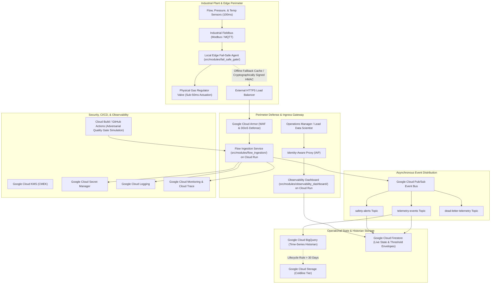

# System Architecture Specification: Industrial Gas Flow Regulator Gate (IGFRG)

> **Status**: `FROZEN / MACRO-ARCHITECTURE BASELINE (Gate 0)`  
> **Source**: Lead Cloud Architect (`/architect-design`)  
> **Contractual Input**: [`docs/PRD.md`](file:///home/npintaux/airliquide-gas-regulator/docs/PRD.md)  
> **Governance**: All downstream subsystem tech leads (`/lead-decompose`) and developers (`/implement`) must conform to the subsystem boundaries and WAF pillars defined herein.

---

## 1. Executive Summary & Macro-Topology

* **Architecture Vision**: The Industrial Gas Flow Regulator Gate (IGFRG) delivers high-precision, safety-critical industrial gas flow regulation through a resilient hybrid architecture combining local deterministic edge fail-safe actuation with scalable Google Cloud Platform services. Ingestion handles up to 10,000 concurrent sensor feeds at 100ms intervals, executing multi-factor safety validation (flow envelopes, pressure/temperature dynamic correlations, and variance detection) within an end-to-end 150ms latency budget. In the event of safety violations or sensor lockup, hardware shutoff or safe-hold interrupts are dispatched within 50ms. Cloud-native components provide asynchronous Pub/Sub event ingestion, real-time Firestore operational state synchronization, long-term BigQuery historian telemetry analytics, automated PR adversarial quality gates via ephemeral Cloud Run tasks, and an Identity-Aware Proxy (IAP) secured Operations Dashboard.
* **Component Topology Diagram**:



---

## 2. Subsystem Macro-Decomposition

The architecture decomposes the IGFRG system into autonomous, decoupled subsystems mapped directly to isolated directory roots to enforce clean architecture boundaries and prevent merge collisions during parallel development:

| Subsystem Name | Directory Root | Core Responsibilities & Domain | Allowed External Dependencies | Assigned Worker |
|---|---|---|---|---|
| **Flow Ingestion Engine** | `src/modules/flow_ingestion/` | High-throughput telemetry packet ingestion (MQTT/Modbus frames), HMAC signature verification, packet parsing, schema validation, and streaming into Pub/Sub. | Google Cloud Pub/Sub, Secret Manager, Cloud Logging | `subagent-flow-ingestion` |
| **Fail-Safe Gate & Quality Engine** | `src/modules/fail_safe_gate/` | Static envelope threshold evaluation, dynamic pressure-temperature correlation checks, sensor freeze/variance detection, sub-50ms hardware interrupt dispatch, edge offline fallback caching, and CI/CD adversarial test simulation. | Google Cloud Pub/Sub, Firestore, Cloud Monitoring | `subagent-fail-safe-gate` |
| **Observability Dashboard & Alerting** | `src/modules/observability_dashboard/` | Real-time flow health visualization, gate state monitoring, incident log triage, automated root-cause summaries, sub-60s engineer alert dispatching, and BigQuery historian analytics querying. | Google Cloud Firestore, BigQuery, Identity-Aware Proxy, Cloud Monitoring | `subagent-observability-dashboard` |

---

## 3. Frozen Cloud Service Decisions

This table is the **authoritative, frozen** record of concrete Google Cloud Platform products committed to by this architecture. Downstream implementation gates read service selections exclusively from this table. Every entry identifies a concrete product with its justifying Well-Architected Framework driver:

| Architectural Concern | Chosen GCP Service | Rationale (WAF Driver) |
|---|---|---|
| Compute Platform | Cloud Run | Fully managed containerized runtime with automated scaling to 10,000 streams and scale-to-zero for adversarial CI simulation — System Design / Cost Optimization |
| Operational State Datastore | Firestore | Low-latency serverless document store with real-time snapshot listeners for live gate status, active alerts, and safety threshold rules — System Design / Performance Optimization |
| Time-Series Historian Datastore | BigQuery | Scalable serverless analytical data warehouse supporting high-throughput streaming ingestion and historical sensor drift analysis — System Design / Operational Excellence |
| Event Messaging & Streaming | Pub/Sub | High-throughput, multi-zone replicated asynchronous event bus with native dead-letter queues and push subscriptions — Reliability and Disaster Recovery / System Design |
| Web Application Firewall & Perimeter | Cloud Armor | Perimeter DDoS defense, IP filtering, and Layer 7 protection for cloud-facing endpoints — Security, Privacy, and Compliance |
| Secrets Management | Secret Manager | Centralized, audited, and versioned store for HMAC signing keys, credentials, and API tokens eliminating plaintext secrets — Security, Privacy, and Compliance |
| Cryptographic Key Management | Cloud KMS | Customer-managed encryption keys (CMEK) for cryptographic protection of data at rest across BigQuery, Firestore, and backups — Security, Privacy, and Compliance |
| Centralized Logging | Cloud Logging | Structured JSON audit and event logging with log-based metric integration — Operational Excellence |
| Metrics & Incident Alerting | Cloud Monitoring | Real-time SLO tracking, incident alerting routed within 60s to on-call personnel, and dashboarding — Operational Excellence / Reliability and Disaster Recovery |
| Distributed Application Tracing | Cloud Trace | End-to-end distributed transaction tracing to guarantee the sub-150ms processing latency budget — Performance Optimization / Operational Excellence |
| Identity & Access Management Perimeter | Identity-Aware Proxy | Context-aware zero-trust authentication and IAM role enforcement for administrative operations and dashboards — Security, Privacy, and Compliance |

---

## 4. Google Cloud Well-Architected Framework (WAF) Compliance

### 4.1 System Design
* **Stateless Compute & Microservice Decoupling**: Ingestion, validation, and dashboard presentation are decomposed into stateless containerized services hosted on Cloud Run across multiple availability zones. Container instances scale horizontally based on concurrent request volume, with memory and CPU sized to maintain deterministic sub-150ms telemetry processing.
* **Dual-Tier Storage Strategy**: Operational state (live valve status, safety envelope configurations, and active incident flags) resides in low-latency Firestore collections, while high-frequency telemetry streams are batched into partitioned BigQuery tables for long-term historical analysis and sensor drift modeling.
* **Decoupled Asynchronous Streaming**: Ingestion services publish validated frames to Google Cloud Pub/Sub topics (`telemetry-events`, `safety-alerts`), decoupling high-frequency edge intake from downstream persistent analytical workloads and incident notification pipelines.
* **Official Documentation Citation**: https://cloud.google.com/architecture/framework/system-design

### 4.2 Operational Excellence
* **Structured Telemetry & Unified Tracing**: All application components emit structured JSON logs to Cloud Logging correlated by a unique `trace_id`. Cloud Trace monitors distributed spans from HTTP ingestion to Pub/Sub dispatch, verifying that processing latency stays within the 150ms budget.
* **SLO Definition & Incident Alerting**: Service Level Objectives (SLOs) mandate 99.99% ingestion availability and sub-150ms P99 processing latency. Cloud Monitoring alert policies detect threshold violations, missing sensor heartbeats, and sensor freeze anomalies, dispatching notifications to PagerDuty/incident response within 60 seconds (US4).
* **Automated CI/CD Adversarial Quality Gates**: Every pull request triggering logic updates runs automated adversarial test suites using Cloud Build and ephemeral Cloud Run tasks to inject synthetic turbulence, vacuum scenarios, and sensor stalls before production promotion (FR-03, US3).
* **Official Documentation Citation**: https://cloud.google.com/architecture/framework/operational-excellence

### 4.3 Security, Privacy, and Compliance
* **Zero-Trust & Identity-Aware Perimeter**: Access to the centralized Operations Dashboard and administrative safety threshold modification endpoints is strictly governed through Identity-Aware Proxy (IAP) backed by Google Cloud IAM roles. Dr. Elena Vance is granted role-based authority to update threshold configurations, while plant operators receive read-only situational awareness.
* **Cryptographic Edge Signing & Non-Repudiation**: Telemetry packets transmitted from plant fieldbuses must include an HMAC-SHA256 signature generated at the edge hardware perimeter. The Cloud Run ingestion gateway verifies signatures before processing, preventing man-in-the-middle spoofing of gas regulator commands.
* **Perimeter Defense & DDoS Protection**: Google Cloud Armor policies defend public load balancer entrypoints against volumetric DDoS attacks, Layer 7 injection, and unauthorized network scans.
* **Cryptographic Data Protection & Secret Isolation**: Zero plaintext credentials exist in configuration files or container images; all encryption keys and fieldbus credentials are dynamically fetched from Secret Manager. All persistent data in Firestore, BigQuery, and storage buckets is encrypted at rest using Cloud KMS Customer-Managed Encryption Keys.
* **Official Documentation Citation**: https://cloud.google.com/architecture/framework/security

### 4.4 Reliability and Disaster Recovery
* **Sub-50ms Hardware Fail-Safe & Offline Fallback**: Physical safety actuation does not depend on cloud network connectivity. The local fail-safe agent (`src/modules/fail_safe_gate/`) executes on plant edge hardware, continuously monitoring 100ms sensor pulses and issuing local hardware close-gate or safe-hold interrupts within 50ms upon critical violation or sensor lockup (FR-04, US2). During complete cloud WAN disconnects, the edge agent switches to Edge-Safe offline fallback mode, caching records locally and reconciling with BigQuery once connection is restored (US5).
* **Multi-Zone High Availability**: Cloud Run, Pub/Sub, and Firestore operate in high-availability multi-zone regional deployments, ensuring 99.99% cloud uptime (NFR Reliability).
* **Idempotent Consumption & Dead-Letter Handling**: Pub/Sub consumers enforce idempotent processing using message sequence identifiers and packet hashes. Malformed or corrupted packets are routed to a dedicated dead-letter topic (`dead-letter-telemetry`) for forensic diagnosis without blocking valid streams.
* **Official Documentation Citation**: https://cloud.google.com/architecture/framework/reliability

### 4.5 Cost Optimization
* **Scale-to-Zero Serverless Economics**: Flow ingestion microservices and CI/CD adversarial test runners hosted on Cloud Run dynamically scale down to zero instances during quiet hours or testing pauses, incurring zero baseline compute idle costs.
* **Tiered Storage Lifecycle Automation**: Historical sensor telemetry in BigQuery uses partitioned tables partitioned by day. Data older than 30 days is automatically exported and archived to Cloud Storage Coldline buckets via automated lifecycle rules, reducing historian storage expenditure (NFR Cost Optimization).
* **Granular Cost Governance**: Subsystem-specific resource labels (`subsystem:flow-ingestion`, `subsystem:fail-safe-gate`, `subsystem:observability`) and Cloud Billing budget alerts ensure visibility and prevent unplanned infrastructure spending.
* **Official Documentation Citation**: https://cloud.google.com/architecture/framework/cost-optimization

### 4.6 Performance Optimization
* **Sub-150ms End-to-End Processing Budget**: High-performance HTTP/gRPC Cloud Run ingestion endpoints process incoming payloads, verify HMAC signatures, evaluate static envelope ranges, and publish messages into Pub/Sub in under 40ms, providing ample headroom beneath the 150ms end-to-end deadline.
* **Connection Pooling & Asynchronous Pipelining**: Ingestion services utilize persistent HTTP/2 and gRPC connection pools for Pub/Sub publishing and Firestore operational state updates, eliminating socket initialization overhead.
* **Distributed Trace Latency Auditing**: Cloud Trace distributed transaction tracing benchmarks latency across each component (network transit, HMAC validation, rule evaluation, and Pub/Sub publishing) to alert on performance degradation before violating the SLA budget.
* **Official Documentation Citation**: https://cloud.google.com/architecture/framework/performance

### 4.7 Sustainability
* **Low-Carbon Google Cloud Region Selection**: Production workloads are deployed in designated low-carbon Google Cloud regions (e.g., `europe-west1` in Belgium or `us-central1` in Iowa) to maximize the Carbon Free Energy (CFE%) percentage of compute and storage operations.
* **Serverless Elastic Efficiency**: Utilizing serverless Cloud Run, Firestore, and BigQuery eliminates dedicated over-provisioned virtual machine instances, ensuring hardware infrastructure is utilized with optimal power efficiency and zero idle energy consumption.
* **Official Documentation Citation**: https://cloud.google.com/architecture/framework/sustainability

---

## 5. Cross-Cutting Infrastructural Blueprint

* **Networking & Ingress Gateway**: External traffic enters via a global HTTPS Load Balancer guarded by Cloud Armor. Internal communication between Cloud Run and GCP managed services travels over Google's private backbone via Serverless VPC Access connectors without exposing database endpoints to the public internet.
* **Authentication, Authorization & IAM**: Workload Identity Federation governs service-to-service communication, granting fine-grained least-privilege IAM roles (e.g., `roles/pubsub.publisher`, `roles/datastore.user`). Human access to dashboard screens is authenticated through Identity-Aware Proxy with multi-factor authentication.
* **Auditability & Traceability**: All access events, configuration changes (such as safety threshold adjustments made by Dr. Vance), and emergency fail-safe activations are recorded in immutable Cloud Audit Logs with forensic retention.

---

## 6. Gate 0 Verification & Subsystem Hand-Off

* **Mechanical WAF Gate**:
  ```bash
  python3 /home/npintaux/.gemini/config/plugins/maestro/scripts/audit_waf_compliance.py docs/architecture.md
  python3 /home/npintaux/.gemini/config/plugins/maestro/scripts/validate_adrs.py docs/adr --architecture docs/architecture.md
  ```
* **Downstream Subsystem Handoffs**:
  1. **Security Architect (`/secops-audit`)**: Ingests `docs/architecture.md` and `docs/adr/` to execute STRIDE threat modeling, IAM least-privilege review, and cryptographic secret boundary auditing.
  2. **Subsystem Tech Leads (`/lead-decompose`)**: Decomposes subsystems into OpenAPI 3.x specifications and executable `SPEC.md` rules within:
     - `src/modules/flow_ingestion/`
     - `src/modules/fail_safe_gate/`
     - `src/modules/observability_dashboard/`
