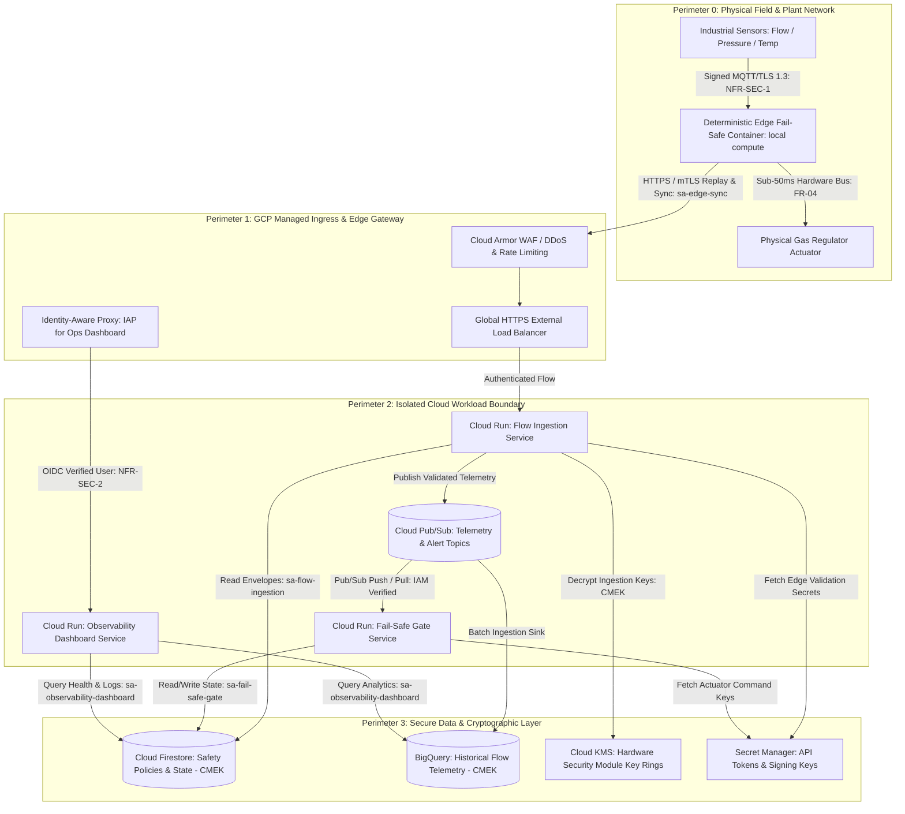

# Security Architecture & Threat Model Specification

## 1. Security Overview & Scope
* **Target Architecture**: Hybrid Edge-Cloud Flow Regulation Architecture (docs/adr/0001-hybrid-edge-cloud-compute.md)
* **Reviewed Subsystems**:
  - `src/modules/flow_ingestion/`: Cloud Run ingestion service handling real-time sensor streams (MQTT/Modbus via IoT bridge), schema and range validation.
  - `src/modules/fail_safe_gate/`: Deterministic edge runtime container and cloud fail-safe coordinator evaluating dynamic correlation envelopes and triggering sub-50ms emergency hardware shutoffs or safe-holds.
  - `src/modules/observability_dashboard/`: Operator web dashboard and incident management service displaying live flow status, gate telemetry, and violation diagnostics behind Identity-Aware Proxy (IAP).
* **Data Classification**: Industrial Safety-Critical Telemetry, Hardware Actuation Controls, and Operational Historian Logs (Confidential / Safety-Critical).
* **Compliance Standards**: Google Cloud Well-Architected Framework (GCWAF) Security Pillar, OWASP API Security Top 10 (2023), NIST SP 800-82 (Guide to Industrial Control Systems Security).
* **Security & Reliability NFR Traceability**:
  - `[NFR-SEC-1]` Data Integrity: End-to-end cryptographic packet signing and validation at edge and ingress to prevent tampering and spoofing.
  - `[NFR-SEC-2]` Access Control: Identity-Aware Proxy (IAP) and IAM RBAC governance restricting threshold and configuration modifications to authorized personnel (e.g., Dr. Elena Vance).
  - `[NFR-REL-1]` High Availability: Multi-zone regional deployment across 3 availability zones ensuring 99.99% uptime.
  - `[NFR-REL-2]` Graceful Degradation & Edge-Safe Fallback: Deterministic local edge container fall-back mode during cloud disconnects.

---

## 2. Trust Boundaries & Data Flow Diagram

The Industrial Gas Flow Regulator Gate (IGFRG) implements a strict Zero Trust model partitioned into four distinct operational perimeters:

### Trust Boundary Crossings & Protocols
1. **TB-01: Plant Field Sensors to Local Edge Runtime**: Physical Modbus/MQTT channels secured with TLS 1.3 and HMAC-SHA256 payload signatures (`[NFR-SEC-1]`).
2. **TB-02: Edge Runtime to Cloud Ingress**: Public internet transit protected by Cloud Armor, mutual TLS / signed JWT payloads, and rate limiting.
3. **TB-03: Cloud Ingress to Cloud Run Services**: Identity validation via GCP IAM service tokens, TLS 1.3, and IAP identity propagation (`[NFR-SEC-2]`).
4. **TB-04: Cloud Run to Pub/Sub Message Bus**: Google internal VPC backbone protected by IAM role bindings per subscription and publisher.
5. **TB-05: Cloud Workloads to Storage Layer (Firestore/BigQuery)**: Customer-Managed Encryption Keys (CMEK) managed via Cloud KMS with envelope encryption.
6. **TB-06: Operator Browser to Observability Dashboard**: HTTPS secured with TLS 1.3, Google Cloud Identity-Aware Proxy (IAP) multi-factor authentication, and RBAC claim verification.

---

## 3. STRIDE Threat Analysis Matrix

| ID | Component / Boundary | STRIDE Category | Threat Description | Severity (H/M/L) | Mitigation Control | Verification Mechanism |
|:---|:---|:---|:---|:---|:---|:---|
| T-01 | Sensor Ingress (`flow_ingestion`) | Spoofing | Adversary or rogue device injects forged sensor packets claiming to be legitimate flow meter | High | Mandatory HMAC-SHA256 signature verification over all sensor telemetry packets; asymmetric edge device certificate validation via mTLS (`[NFR-SEC-1]`) | Automated integration tests with invalid signature rejection; mTLS handshake verification suite |
| T-02 | Telemetry Pipeline (Pub/Sub & Storage) | Tampering | Malicious actor modifies flow readings or threshold bounds in transit or in database to mask catastrophic gas leaks | High | Enforce TLS 1.3 in transit across all endpoints; Cloud KMS Customer-Managed Encryption Keys (CMEK) for Firestore and BigQuery; append-only schema on telemetry tables | Cryptographic digest audit script; continuous BigQuery immutable table policy validation; IAM role audit |
| T-03 | Operator Actions & Overrides (`observability_dashboard`) | Repudiation | Operator modifies dynamic safety envelope thresholds or triggers manual bypass and denies taking action | High | Google Cloud Audit Logs (Admin Activity and Data Access) routed to an immutable Cloud Storage log bucket with Object Retention Lock; signed audit event records (`[NFR-SEC-2]`) | Cloud Logging sink configuration assertion; tamper-evident log integrity verification test |
| T-04 | API Error Handling & Diagnostics (`flow_ingestion`, `observability_dashboard`) | Information Disclosure | Unhandled runtime exceptions or malformed payloads leak internal server paths, database connection strings, or sensor hardware topologies | Med | Global exception handlers mapping all errors to RFC 7807 problem payloads (`application/problem+json`); elimination of stack traces in API responses | Negative testing with fuzzing payloads; automated regex scans on API response bodies in contract tests |
| T-05 | Ingress Load Balancer & Public Ingestion | Denial of Service | Volumetric DDoS or sensor flooding attack (>10,000 streams) exhausts Cloud Run concurrency and prevents safety processing | High | Cloud Armor adaptive DDoS protection, IP throttling, and layer 7 rate limiting (max 500 req/min per edge gateway IP); Cloud Run auto-scaling with reserved minimum instances (`[NFR-REL-1]`) | Synthetic flood simulation tests; Cloud Armor security policy inspection; load test with 15,000 concurrent mock streams |
| T-06 | Subsystem Container Runtime | Elevation of Privilege | Attacker exploits dependency vulnerability in `flow_ingestion` container to gain root or lateral access to `fail_safe_gate` actuator commands | High | Dedicated granular Service Accounts per subsystem; execution within non-root, read-only root filesystem distroless containers; strict IAM role scoping | Container vulnerability scan (`bandit`, Trivy); automated IAM policy checker confirming no broad primitive access |

---

## 4. IAM Least-Privilege Role Matrix

All services adhere to the principle of least privilege. In accordance with Maestro security invariants, broad administrative privileges are strictly prohibited and replaced by granular permissions. Each subsystem executes under a dedicated GCP Service Account scoped down to specific resources.

| Subsystem / Service | Dedicated Service Account | Assigned Granular GCP IAM Roles | Resource Scope |
|:---|:---|:---|:---|
| Flow Ingestion Service (`flow_ingestion`) | `sa-flow-ingestion@airliquide-igfrg.iam.gserviceaccount.com` | `roles/pubsub.publisher`, `roles/datastore.viewer`, `roles/secretmanager.secretAccessor`, `roles/cloudkms.cryptoKeyDecrypter`, `roles/monitoring.metricWriter` | Telemetry topic, safety envelope collection, edge HMAC secret, KMS telemetry key, project metric sink |
| Fail-Safe Gate Service (`fail_safe_gate`) | `sa-fail-safe-gate@airliquide-igfrg.iam.gserviceaccount.com` | `roles/pubsub.subscriber`, `roles/pubsub.publisher`, `roles/datastore.user`, `roles/secretmanager.secretAccessor`, `roles/cloudkms.cryptoKeyEncrypterDecrypter`, `roles/monitoring.metricWriter` | Fail-safe subscription, emergency command topic, gate states collection, actuator signing secret, KMS state key |
| Observability Dashboard (`observability_dashboard`) | `sa-observability-dashboard@airliquide-igfrg.iam.gserviceaccount.com` | `roles/datastore.viewer`, `roles/bigquery.dataViewer`, `roles/bigquery.jobUser`, `roles/monitoring.viewer`, `roles/iap.httpsResourceAccessor` | Firestore documents, BigQuery historian dataset, Cloud Monitoring metrics, IAP dashboard backend |
| Edge Synchronizer Agent (`fail_safe_gate` edge) | `sa-edge-sync@airliquide-igfrg.iam.gserviceaccount.com` | `roles/run.invoker`, `roles/secretmanager.secretAccessor` | Cloud Run ingestion endpoint, edge device client certificate secret |

---

## 5. Secret Inventory & Cryptographic Controls

All secrets, cryptographic keys, and sensitive tokens are strictly isolated within Google Cloud Secret Manager and Cloud KMS. Under no circumstances are plaintext keys or tokens checked into version control or passed as unencrypted environment variables.

| Secret Name | Storage Mechanism | Consumer Service Account | Encryption Standard | Rotation Schedule |
|:---|:---|:---|:---|:---|
| `edge-hmac-key` | Google Cloud Secret Manager | `sa-flow-ingestion`, `sa-edge-sync` | Cloud KMS CMEK (AES-256-GCM) | 90 Days (Automated via Cloud Functions + Pub/Sub notification) |
| `actuator-command-sign-key` | Google Cloud Secret Manager | `sa-fail-safe-gate` | Cloud KMS CMEK (AES-256-GCM / Ed25519) | 90 Days (Automated) |
| `iap-oauth-client-secret` | Google Cloud Secret Manager | `sa-observability-dashboard` | Cloud KMS CMEK (AES-256-GCM) | 180 Days |
| `edge-device-client-cert` | Google Cloud Secret Manager | `sa-edge-sync` | Cloud KMS CMEK (RSA-4096 / TLS 1.3) | 365 Days (Automated rotation with 30-day overlap) |
| `telemetry-kek` | Google Cloud KMS KeyRing | Cloud Run internal runtime | AES-256-GCM (Hardware HSM Protection Level) | 90 Days (KMS automatic key rotation) |

---

## 6. OWASP API Top 10 Mitigation Summary

All subsystem contracts (`flow_ingestion`, `fail_safe_gate`, `observability_dashboard`) conform to OWASP API Security Top 10 (2023) standards:

* **API1:2023 Broken Object Level Authorization (BOLA)**: Every sensor stream ingestion request and dashboard state inquiry validates plant ID, sensor ID, and tenant scope against the authenticated context. The `observability_dashboard` enforces fine-grained authorization ensuring users only inspect regulators within their assigned physical zone.
* **API2:2023 Broken Authentication**: Ingress endpoints reject static credentials. Edge gateways authenticate via ephemeral mTLS certificates with short-lived OAuth 2.0 / OIDC tokens issued by GCP IAM Workload Identity Federation. Operators authenticate through Google Identity-Aware Proxy (IAP) with corporate SSO and MFA (`[NFR-SEC-2]`).
* **API3:2023 Broken Object Property Level Authorization**: Ingestion contracts defined in `openapi.yaml` use strict schema validation (Pydantic / dataclass definitions). Excess, undeclared, or read-only properties (such as internal safety threshold overrides) are rejected with HTTP 422 Unprocessable Entity.
* **API4:2023 Unrestricted Resource Consumption**: Cloud Armor enforces rate limiting (500 requests/minute per client IP) on ingestion endpoints. Cloud Run instance limits (`max-instances: 100`, `concurrency: 80`) protect downstream Pub/Sub and datastore resources. Payload body sizes are strictly capped at 256KB.
* **API5:2023 Broken Function Level Authorization**: Administrative functions (e.g. updating safety envelope thresholds or triggering physical bypass) enforce role-based claims (`roles/safety.administrator`). Read-only operator accounts are denied execution access at the API route layer with HTTP 403 Forbidden.
* **API6:2023 Unrestricted Access to Sensitive Business Flows**: Critical industrial business flows (emergency gate reset, safety envelope recalibration) require multi-party approval and re-authentication challenge via IAP before execution, logged to Cloud Audit Logs.
* **API7:2023 Server Side Request Forgery (SSRF)**: Subsystem services have no user-controllable egress destination endpoints. Egress is locked down via Google Cloud Serverless VPC Access connector with firewall rules blocking internal RFC 1918 metadata ranges (`169.254.169.254`).
* **API8:2023 Security Misconfiguration**: Container images are built using Google Distroless base images, executing as non-root users (`UID 10001`) with read-only root filesystems. All HTTP response headers enforce HSTS (`max-age=31536000; includeSubDomains`), `X-Content-Type-Options: nosniff`, and restrictive Content Security Policy (CSP).
* **API9:2023 Improper Inventory Management**: All API versions are versioned (`/v1/`) and specified in canonical OpenAPI 3.x specifications (`src/modules/*/openapi.yaml`). Deprecated API endpoints are automatically decommissioned via API Gateway routing policies.
* **API10:2023 Unsafe Consumption of APIs**: Upstream communications with field actuators and sensor relays validate response payloads against strict typing schemas with 50ms timeouts and circuit breaker patterns to prevent cascading failures.
